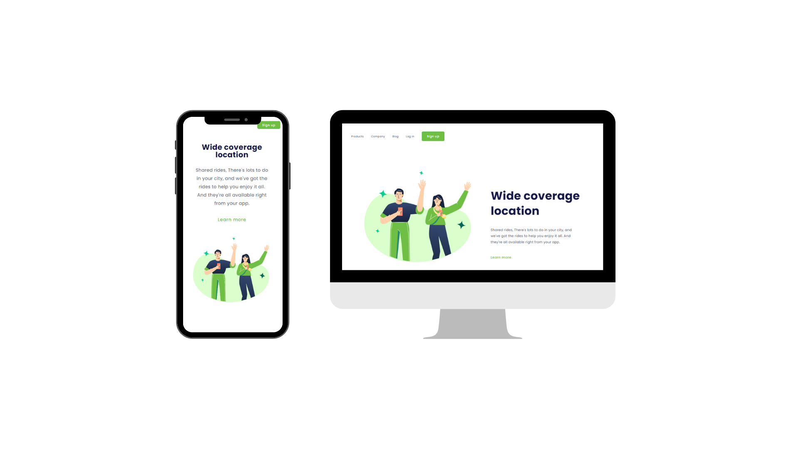

# Projeto Wide Coverage Location - Aplicação Responsiva

Este é um projeto desenvolvido durante as aulas do DevClub, com base em um desafio proposto pelo professor Rodolfo Mori. A proposta foi criar uma aplicação web responsiva, ou seja, capaz de se adaptar a diferentes dispositivos, como celulares, tablets, notebooks e desktops.

  Acesse: https://tiagogrillolermy.github.io/projeto-responsivo-wide-coverage-location/

## Tecnologias Utilizadas

- HTML
- CSS

## Descrição

O objetivo deste projeto foi explorar as técnicas de desenvolvimento de uma aplicação web responsiva. Ao longo das aulas, aprendemos como utilizar o HTML e o CSS para criar uma interface que se adapte de forma adequada a diferentes tamanhos de tela.

## Funcionalidades

A aplicação possui as seguintes funcionalidades:

- Responsividade: a interface se ajusta automaticamente de acordo com o tamanho da tela do dispositivo utilizado pelo usuário.
- Navegação intuitiva: os elementos da interface foram projetados de forma a facilitar a navegação e proporcionar uma experiência agradável ao usuário.

## Autor

- [Tiago Grillo Lermy](https://github.com/TiagoGrilloLermy)

## Agradecimentos

Gostaríamos de agradecer ao professor [Rodolfo Mori](https://github.com/rodolfomori) por propor o desafio e ao <a href="https://rodolfomori.com.br/devclub/">DevClub<a> pelas aulas e suporte durante o desenvolvimento deste projeto.
